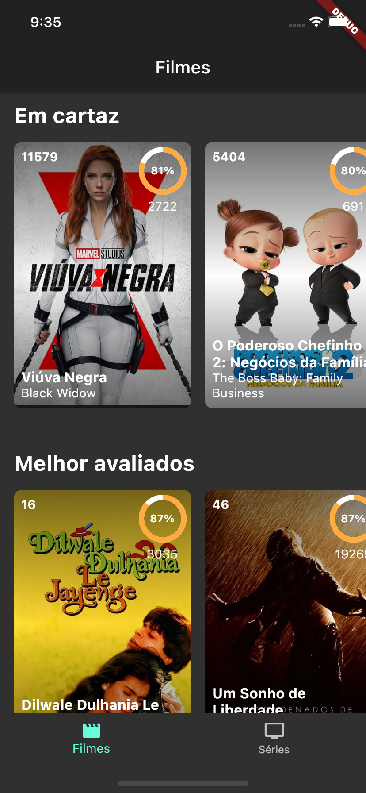
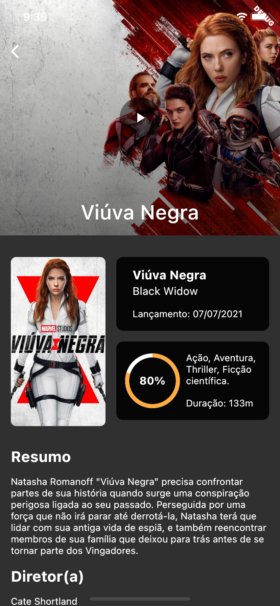
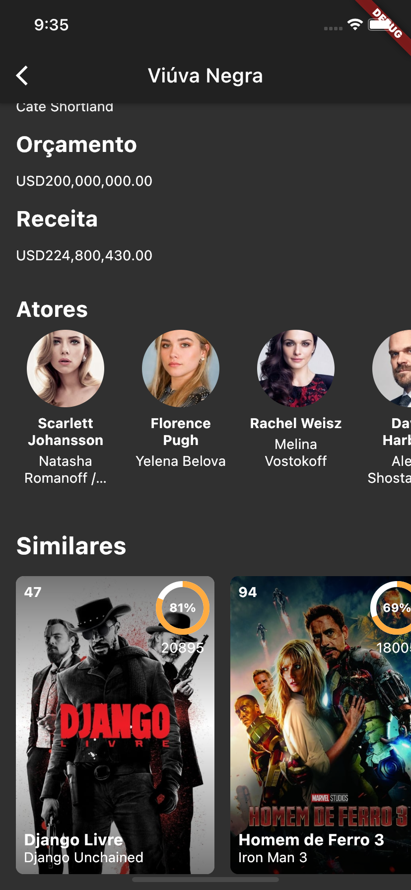
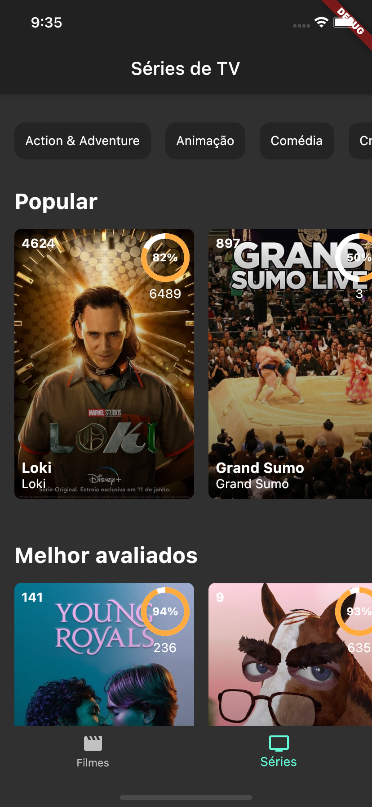
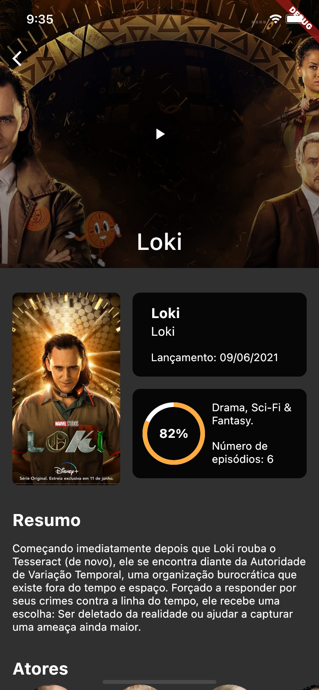

# TMDB Filmes e Séries

Projeto em flutter de App que consome a api do [TMDB](https://developers.themoviedb.org/3/getting-started/introduction) para listar filmes e séries.

## Como executar o projeto

Para começar, verifique a integridade da sua instalação do flutter
    
    flutter doctor

clone o projeto e vá para o diretório dele

    git clone https://github.com/matheustimbo/TMDBMoviesFlutter
    cd TMDBMoviesFlutter
    
então, baixe as dependências do projeto e execute em modo debug

    flutter pub get
    flutter run

## Arquitetura

Nesse projeto, segui a arquitetura do flutter modular, separando a estrutura do projeto em módulos e uma pasta core ou shared onde ficam arquivos importantes para mais de um módulo.

## Bibliotecas utilizadas

- [flutter_modular](https://pub.dev/packages/flutter_modular) Estrutura de navegação, injeção de dependências 
- [dio](https://pub.dev/packages/dio) Cliente HTTP
- [mobx](https://pub.dev/packages/mobx) Gerenciamento de estado
- [flutter_mobx](flutter_mobx) Widget Observer para ouvir observables e reconstruir o componente filho quando houver mudanças
- [build_runner](https://pub.dev/packages/build_runner) Gera código dart dos arquivos mobx
- [skeleton_animation](https://pub.dev/packages/skeleton_animation) Animação Skeleton para carregamentos
- [youtube_player_flutter](https://pub.dev/packages/youtube_player_flutter) Player do Youtube
- [intl](https://pub.dev/packages/intl) Utilitários de internacionalização e localização
- [cached_network_image](https://pub.dev/packages/cached_network_image) Cache de imagens

## Telas do aplicativo

Lista de filmes

  
  

Detalhes do filme

  
  

Lista de séries

  

Detalhes da série

  

